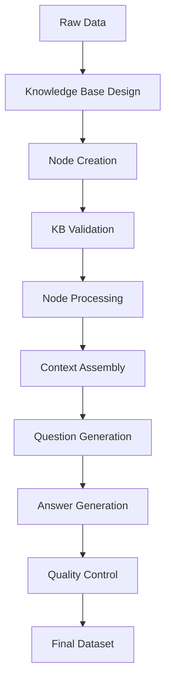

# LLaMA Instruction Dataset Preparation Agent

An agent-based system for preparing instruction datasets from knowledge bases.

## Philosophy

This project is built on several key principles:

1. **Resilience First**: The system is designed to be resilient against failures at every step. Rather than failing fast, it employs intelligent retry mechanisms with exponential backoff to maximize the chances of successful dataset entry creation.

2. **Quality Over Quantity**: Each dataset entry goes through multiple validation stages:
   - Question validation before instruction creation
   - Response quality checking
   - Format validation at multiple stages
   - Final comprehensive validation of the complete entry

3. **Contextual Awareness**: The system maintains context from parent and child nodes when processing knowledge base entries, ensuring that generated questions and responses have sufficient context to be meaningful.

4. **Traceability**: Every step of the process is logged and tracked:
   - Unique IDs for each entry
   - Detailed logging of attempts and retries
   - Metadata preservation throughout the pipeline
   - Complete audit trail in log files

## System Philosophy & Architecture

### Core Principles

1. **Robustness First**: The system is designed to handle large-scale knowledge base processing with built-in recovery mechanisms. It prioritizes reliability over speed, ensuring that no data is lost even in case of failures.

2. **Comprehensive Logging**: Every operation is logged with detailed metadata, enabling:
   - Full audit trail of processed nodes
   - Error tracking and debugging
   - Progress monitoring
   - Data quality assessment

3. **Stateful Processing**: The system maintains state through various .jsonl files:
   - `nodetraversal.jsonl`: Tracks processed nodes
   - `chunks.jsonl`: Records text chunks
   - `questions.jsonl`: Stores generated questions
   - `dataset.jsonl`: Contains final dataset entries
   - `errors.jsonl`: Logs all errors with context

### Processing Strategies

1. **Knowledge Base Traversal**:
   - Sequential processing of nodes
   - Support for both limited and full traversal
   - Intelligent handling of parent/child relationships
   - Progress tracking with node counts

2. **Text Processing**:
   - Chunking of large texts with overlap
   - Context preservation across chunks
   - Parent/child context inclusion
   - Metadata preservation throughout pipeline

3. **Question Generation**:
   - Multi-stage validation
   - Quality checks
   - Context-aware question generation
   - Duplicate detection

### Error Handling & Recovery

The system implements a comprehensive error handling strategy designed for long-running, mission-critical data processing:

1. **Automatic Recovery**:
   - 10-minute cooldown after errors
   - Automatic restart from last successful node
   - Preservation of all progress
   - Stateful recovery across restarts

2. **Error Logging**:
   ```json
   {
     "timestamp": "2025-01-16T23:20:56",
     "error_type": "OllamaError",
     "error_message": "Connection refused",
     "context": "Processing node ABC123"
   }
   ```

3. **Recovery Process**:
   - Error detection at multiple levels
   - Context preservation
   - Last node identification
   - Graceful shutdown
   - Automatic restart

4. **Error Prevention**:
   - Rate limiting
   - Resource monitoring
   - Progress tracking
   - State validation

### File Structure

```
data/
  ├── dataset.jsonl       # Final dataset entries
  ├── chunks.jsonl        # Processed text chunks
  ├── questions.jsonl     # Generated questions
  ├── nodetraversal.jsonl # Node processing state
  ├── errors.jsonl        # Error log
  └── error_recovery.log  # Recovery process log
```

### Usage

1. **Full Knowledge Base Processing**:
   ```bash
   python create_dataset.py full-kb.json dataset.jsonl
   ```

2. **Node-Based Processing**:
   ```bash
   python create_dataset_from_node.py full-kb.json dataset.jsonl <node_id> --limit all
   ```

3. **Limited Processing**:
   ```bash
   python create_dataset_from_node.py full-kb.json dataset.jsonl <node_id> --limit 5
   ```

### Monitoring & Debugging

1. **Progress Monitoring**:
   - Check `nodetraversal.jsonl` for processed nodes
   - Monitor `dataset.jsonl` for generated entries
   - Review `error_recovery.log` for system status

2. **Error Investigation**:
   - Check `errors.jsonl` for error details
   - Review `error_recovery.log` for recovery attempts
   - Inspect relevant node in `nodetraversal.jsonl`

3. **Quality Assessment**:
   - Review `questions.jsonl` for question quality
   - Check `chunks.jsonl` for text processing
   - Analyze `dataset.jsonl` for final outputs

## System Flow

The dataset preparation follows a carefully orchestrated flow:

### 1. Knowledge Base Traversal
```
Root Node
├── Get main context
├── Collect parent context
└── Collect child context
```

### 2. Context Processing
```
Combined Context
├── Check length (>2000 words?)
│   ├── Yes -> Split into chunks with overlap
│   └── No  -> Process as single chunk
└── Log to chunks.jsonl
```

### 3. Dataset Entry Creation
Each chunk goes through a multi-stage pipeline:

```
Question Generation
└── Instruction Creation
    └── Response Generation
        └── Quality Check
            └── Final Formatting
```

Each stage employs retry-until-success with exponential backoff:
- Initial retry delay: 1 second
- Exponential increase up to 15 seconds
- Maximum total retry time: 60 seconds per stage

### 4. Validation Layers

```
Entry Validation
├── Content Validation
│   ├── Minimum length checks
│   ├── Format validation
│   └── Content quality checks
├── Structure Validation
│   ├── Required fields
│   ├── JSON structure
│   └── Nested object checks
└── Metadata Validation
    ├── Entry ID
    ├── Node references
    └── Timestamps
```

### 5. File Management

The system maintains several key files:
- `chunks.jsonl`: Raw context chunks
- `questions.jsonl`: Generated questions
- `dataset.jsonl`: Final dataset entries
- `nodetraversal.jsonl`: Processing metadata
- `token_cost.json`: API usage tracking

## Error Handling Philosophy

The system follows a "never give up" approach to error handling:
1. Every operation that could fail is wrapped in retry logic
2. Retries use exponential backoff to avoid overwhelming the system
3. Each retry attempt is logged for debugging
4. Only after exhausting all retries (60 second timeout) will an operation fail
5. Failures are logged with detailed context for post-mortem analysis

## Data Pipeline: From Raw Data to Instruction Dataset

### 1. Knowledge Base Construction

The process begins with raw data that needs to be transformed into a structured knowledge base:

1. **Data Analysis**:
   - Identify key concepts and relationships
   - Map hierarchical structures
   - Define node types and attributes
   - Plan parent-child relationships

2. **Knowledge Graph Design**:
   ```json
   {
     "nodes": {
       "node_id": {
         "text": "Node definition or content",
         "parents": ["parent1_url", "parent2_url"],
         "children": ["child1_url", "child2_url"],
         "metadata": {
           "type": "concept|definition|example",
           "domain": "specific_domain",
           "complexity": "basic|intermediate|advanced"
         }
       }
     }
   }
   ```

3. **Node Creation**:
   - Extract core concepts
   - Write clear definitions
   - Establish hierarchical links
   - Add contextual metadata

4. **Knowledge Base Validation**:
   - Verify node connections
   - Check for orphaned nodes
   - Validate relationship consistency
   - Ensure data quality

### 2. Knowledge Base Processing

Once the knowledge base is constructed, it undergoes preprocessing:

1. **Node Analysis**:
   - Text length assessment
   - Context evaluation
   - Relationship mapping
   - Metadata validation

2. **Context Assembly**:
   ```python
   {
     "main_node": "Core concept definition",
     "parent_context": "Parent nodes' definitions",
     "child_context": "Child nodes' definitions",
     "full_context": "Combined context with relationships"
   }
   ```

3. **Text Processing**:
   - Chunk large texts
   - Preserve context across chunks
   - Handle special characters
   - Maintain metadata links

### 3. Instruction Dataset Creation

The final phase transforms the processed knowledge base into an instruction dataset:

1. **Question Generation**:
   - Analyze node content
   - Identify key concepts
   - Generate diverse question types
   - Ensure context coverage

2. **Answer Generation**:
   - Extract relevant context
   - Generate precise answers
   - Validate against source
   - Include supporting details

3. **Dataset Entry Format**:
   ```json
   {
     "instruction": "Generated question or task",
     "context": "Relevant knowledge base context",
     "response": "Generated answer",
     "metadata": {
       "source_node": "original_node_id",
       "question_type": "definition|explanation|comparison",
       "difficulty": "basic|intermediate|advanced"
     }
   }
   ```

4. **Quality Control**:
   - Question relevance check
   - Answer accuracy validation
   - Context completeness
   - Format consistency

### Pipeline Flow



### Data Transformation Example

1. **Raw Data**:
   ```text
   Patent Assets include Design Patents, Utility Patents, and Plant Patents...
   ```

2. **Knowledge Base Node**:
   ```json
   {
     "node_id": "RCBP9N5ER7Y6inNQdjggrKt",
     "text": "Patent Assets are a type of Intellectual Property Asset...",
     "children": [
       "/nodes/Design_Patent_Assets",
       "/nodes/Utility_Patent_Assets",
       "/nodes/Plant_Patent_Assets"
     ]
   }
   ```

3. **Processed Context**:
   ```json
   {
     "main_text": "Patent Assets are a type of Intellectual Property Asset...",
     "child_context": "Design Patent Assets are...\nUtility Patent Assets are...",
     "full_context": "Combined hierarchical context..."
   }
   ```

4. **Final Dataset Entry**:
   ```json
   {
     "instruction": "What are the three main types of Patent Assets?",
     "context": "Patent Assets are a type of Intellectual Property Asset...",
     "response": "The three main types of Patent Assets are Design Patent Assets, Utility Patent Assets, and Plant Patent Assets.",
     "metadata": {
       "source_node": "RCBP9N5ER7Y6inNQdjggrKt",
       "question_type": "classification"
     }
   }
   ```

This pipeline ensures that the final instruction dataset:
- Maintains data integrity
- Preserves contextual relationships
- Generates high-quality instruction-response pairs
- Includes comprehensive metadata for tracking and analysis

## Setup

1. Clone the repository:
```bash
git clone https://github.com/yourusername/llama-instruct-dataset-prep-agent.git
cd llama-instruct-dataset-prep-agent
```

2. Create and activate virtual environment:
```bash
python -m venv venv
source venv/bin/activate  # Linux/Mac
# OR
.\venv\Scripts\activate  # Windows
```

3. Install dependencies:
```bash
pip install -r requirements.txt
```

4. Start Ollama server and ensure model is available:
```bash
ollama run llama3:8b
```

## Running the Pipeline

### Full Pipeline
Run both knowledge base creation and dataset generation:
```bash
python main.py --owl-input input.owl --kb-output kb.json --dataset-output dataset.json --kb-limit [number|all] --dataset-limit [number|all]
```
Arguments:
- `--owl-input`: Path to input OWL file
- `--kb-output`: Path to save knowledge base JSON
- `--dataset-output`: Path to save final dataset
- `--kb-limit`: Number of classes/properties to process for knowledge base or 'all'
- `--dataset-limit`: Number of nodes to process for dataset creation or 'all'

Examples:
```bash
# Process everything
python main.py --owl-input input.owl --kb-output kb.json --dataset-output dataset.json --kb-limit all --dataset-limit all

# Process 100 classes but only generate dataset from 10 nodes
python main.py --owl-input input.owl --kb-output kb.json --dataset-output dataset.json --kb-limit 100 --dataset-limit 10

# Process all classes but limit dataset generation
python main.py --owl-input input.owl --kb-output kb.json --dataset-output dataset.json --kb-limit all --dataset-limit 50
```

This will:
1. Create knowledge base from OWL file (using kb-limit)
2. Generate instruction dataset from knowledge base (using dataset-limit)
3. Write outputs to specified files

### Individual Components

1. Build Knowledge Base:
```bash
python build_knowledge.py --input path/to/input/files --output knowledge_base.json
```
Arguments:
- `--input`: Directory containing input files
- `--output`: Path to save knowledge base JSON
- `--limit`: (Optional) Limit number of files to process

2. Analyze Knowledge Base:
```bash
python analyze_kb.py --kb-path knowledge_base.json --output analysis.json
```
Arguments:
- `--kb-path`: Path to knowledge base JSON
- `--output`: Path to save analysis results
- `--visualize`: (Optional) Generate visualizations

3. Create Dataset:
```bash
python create_dataset.py --kb-path knowledge_base.json --output dataset.json --limit [number|all]
```
Arguments:
- `--kb-path`: Path to knowledge base JSON
- `--output`: Path to save dataset
- `--limit`: Number of nodes to process or 'all' for entire knowledge base

4. Create Dataset from Specific Node:
```bash
python create_dataset_from_node.py full-kb.json dataset.jsonl RCBP9N5ER7Y6inNQdjggrKt --limit all
```
Arguments:
- First argument: Path to knowledge base JSON file
- Second argument: Path to output dataset file
- Third argument: Node ID to start traversal from
- `--limit`: Number of nodes to process or 'all' for entire knowledge base

The dataset creation process:
1. Generates multiple questions for each chunk of text
2. Validates questions for quality and uniqueness
3. Creates instruction-response pairs for each valid question
4. Writes entries immediately to dataset.jsonl

Each dataset entry contains:
```json
{
    "instruction": "Clear instruction based on question",
    "context": "Original text chunk",
    "response": "Direct answer based on context"
}
```

## Output Files

The pipeline generates several files:
- `data/chunks.jsonl`: Individual text chunks with their node references
- `data/questions.jsonl`: Generated questions for each chunk
- `data/dataset.jsonl`: Final instruction dataset entries
- `class_counter.txt`: Statistics about processed classes
- `token_cost.json`: Token usage tracking

## Testing

### Setup Test Environment
```bash
# Create virtual environment if not already done
python -m venv venv
source venv/bin/activate  # Linux/Mac
# OR
.\venv\Scripts\activate  # Windows

# Install test dependencies
pip install -r tests/requirements.txt
```

### Run Tests
```bash
# Run all tests
pytest tests/

# Run with coverage report
pytest tests/ --cov=./ --cov-report=term-missing

# Run specific test file
pytest tests/test_agents.py
pytest tests/test_pipeline.py

# Run specific test function
pytest tests/test_agents.py::test_questioner_agent
```

### Test Coverage
The test suite covers:
1. Agent Functions
   - Question generation and validation
   - Instruction and response creation
   - Text cleaning and processing
   
2. Pipeline Components
   - Knowledge base creation from OWL
   - Dataset generation from knowledge base
   - End-to-end pipeline integration

### Writing New Tests
Add new tests to:
- `tests/test_agents.py` for agent functionality
- `tests/test_pipeline.py` for pipeline components
- `tests/conftest.py` for shared fixtures and setup

## Monitoring

- Check `dataset_creation.log` for detailed processing logs
- Monitor the `data/` directory for real-time output
- Use `analyze_kb.py` to generate statistics about the knowledge base